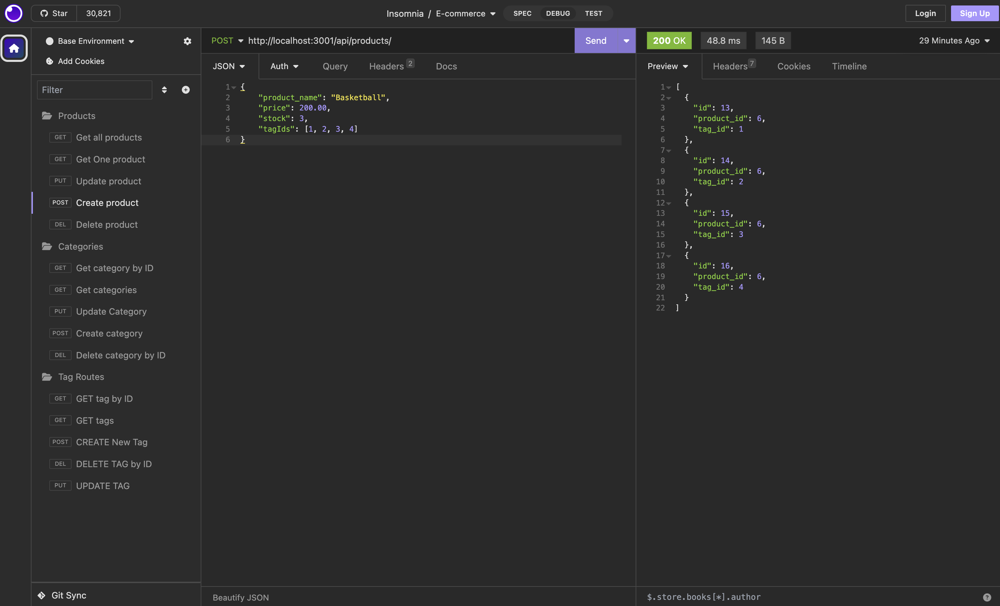

# E-Commerce-Store

## Description

My motivation was to create a back-end for an e-commerce site. I built this project because of how prevalent internet retail has become across the globe. This problem solves diorganization when it comes to inventory. I learned how to configure a Express.js API to use Sequelize in order for it to interact with a MySQL database. 

## Table of Contents (Optional)

- [Installation](#installation)
- [Usage](#usage)
- [Credits](#credits)
- [License](#license)

## Installation

N/A

## Usage

Link to screencastify video: https://drive.google.com/file/d/1mRF0KVEHtj58ouAsb0bsXG_Gss49byTv/view?usp=sharing

## Credits

Isabella Vega - https://github.com/ivega16

## License

## Features

Website

## How to Contribute

Isabella Vega

## Tests

Using VS Code and Insomnia
